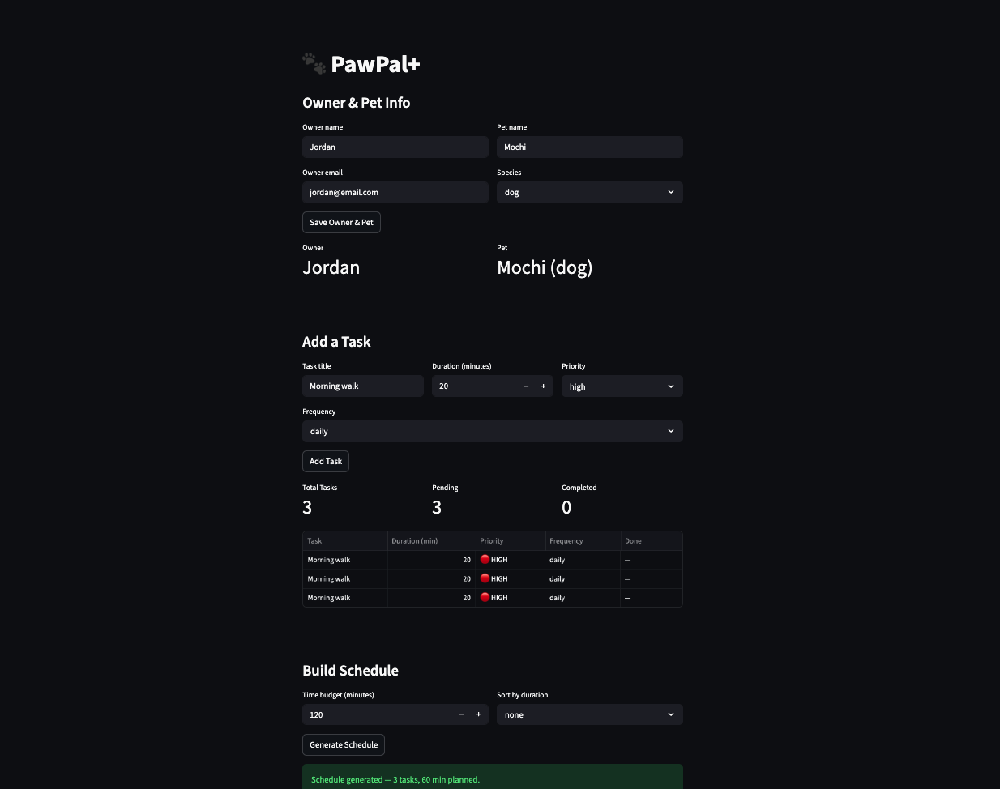

# PawPal+

**PawPal+** is a Streamlit app that helps a pet owner plan care tasks for their pet.

## Scenario

A busy pet owner needs help staying consistent with pet care. They want an assistant that can:

- Track pet care tasks (walks, feeding, meds, enrichment, grooming, etc.)
- Consider constraints (time available, priority, owner preferences)
- Produce a daily plan and explain why it chose that plan

## Features

- **Priority-based scheduling** — tasks are sorted HIGH → LOW before being placed into the day's plan; ties are broken by shortest duration first
- **Time-budget fitting** — the scheduler greedily fits as many tasks as possible within a configurable minute budget, skipping any that would exceed it
- **Daily & weekly recurrence** — completing a recurring task automatically queues a fresh copy with a due date calculated using `timedelta` (daily: +1 day, weekly: +7 days)
- **Conflict detection** — compares every pair of scheduled entries using interval overlap logic and flags any two tasks whose time windows intersect
- **Sort by duration** — the schedule can be reordered shortest-to-longest or longest-to-shortest after generation, without re-running the scheduler
- **Filter by pet or status** — the schedule can be narrowed to a single pet, to pending-only tasks, or both combined
- **Completion tracking** — each task carries a `completed` boolean and a `due_date`; one-off tasks (e.g. monthly) are simply marked done with no re-queue
- **Schedule summary** — produces a formatted plan string showing each task's start time, priority level, pet, and duration

## 📸 Demo



## Getting started

### Setup

```bash
python -m venv .venv
source .venv/bin/activate  # Windows: .venv\Scripts\activate
pip install -r requirements.txt
```

### Testing PawPal+

```bash
python -m pytest
```

Tests cover task completion, pet task tracking, schedule sorting, daily recurrence, and conflict detection.

Confidence Level (system reliability): 4 stars

